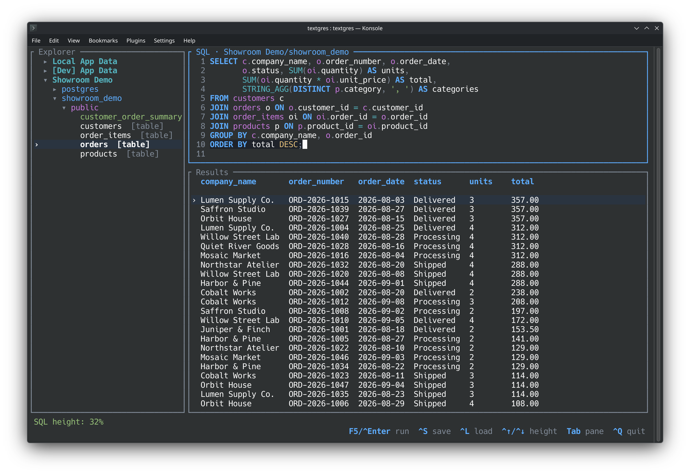

# Textgres



Textgres is a PostgreSQL exploration TUI built with
[Ratatui](https://ratatui.rs/). It provides a connection tree, SQL editor,
result table, expanded row viewer, saved scripts, and optional SSH access.
The installed command is `tg`.

Textgres is an early-stage project. It currently supports:

- Saved PostgreSQL connection profiles and passwords.
- Optional persistent SSH connections through the local OpenSSH client.
- An expandable `connection → database → schema → table` explorer.
- Table previews with primary-key-safe row editing.
- Multi-line SQL editing with live syntax highlighting.
- Saved SQL scripts.
- Bounded result tables with measured column widths.

## Requirements

- A current stable Rust toolchain.
- Network access to a PostgreSQL server.
- The OpenSSH `ssh` command when SSH is enabled.

## Install

Install the latest version from GitHub:

```sh
cargo install --git https://github.com/icdevin/textgres --locked
```

On Linux, this uses the system OpenSSL library. To compile and embed OpenSSL
instead:

```sh
cargo install --git https://github.com/icdevin/textgres --locked \
  --features vendored-openssl
```

Both commands install the `tg` executable. The vendored feature has no effect on
macOS, where the operating system TLS framework is used.

## Run from source

Run from the repository:

```sh
cargo run --release
```

Or install the executable locally:

```sh
cargo install --path .
tg
```

## Getting started

1. Press `n` in the Explorer to create a connection.
2. Enter the PostgreSQL settings. Use `Tab` to change fields and `Ctrl+S` to save.
3. Press `Enter` on the connection, database, and schema to expand them.
4. Press `Enter` on a table to load its first 200 rows.
5. Use `Tab` to move between the Explorer, SQL editor, and Results.
6. Press `F5` in the SQL editor to run SQL against the active database.

Expanding a connection selects its default database as the SQL target. Selecting
another database changes that target.

## Connections

The PostgreSQL section contains the database host, port, default database, user,
password, and TLS setting. When no password is saved, Textgres uses `PGPASSWORD`
when that environment variable exists.

TLS uses the operating system trust store and verifies the PostgreSQL server
certificate. The TLS toggle does not configure client certificates.

### SSH

Enable the SSH section when PostgreSQL is reachable through an SSH host:

- **Host**: SSH server or an alias from `~/.ssh/config`.
- **Port**: SSH server port, usually `22`.
- **User**: SSH account name.
- **Identity file**: Optional path to a private key, such as
  `~/.ssh/id_ed25519`. Do not select the `.pub` file.

The host and port in the PostgreSQL section remain the PostgreSQL endpoint as seen
from the SSH server. Do not replace them with the local forwarded address.

Textgres starts one OpenSSH connection per profile and reuses it until the profile
changes, is deleted, or Textgres exits. OpenSSH configuration such as `ProxyJump`
applies when the SSH host is a configured alias.

SSH is non-interactive. Authentication must already work through `ssh-agent`,
OpenSSH configuration, or the selected identity file. Encrypted keys must be loaded
into `ssh-agent`. SSH password and key-passphrase prompts are not supported.

Textgres requires an existing trusted host key. Connect with `ssh` once before using
the profile if the SSH host is not yet in `known_hosts`.

## Keyboard controls

The bottom bar shows controls for the active pane or dialog. `^` means `Ctrl`.

| Context | Keys | Action |
| --- | --- | --- |
| Global | `Tab` / `Shift+Tab` | Select the next or previous pane |
| Global | `Ctrl+Q` | Quit |
| Explorer | `↑` / `↓`, `j` / `k` | Move selection |
| Explorer | `Home` / `End`, `g` / `G` | Select the first or last item |
| Explorer | `Enter`, `Space`, `→` | Expand or activate |
| Explorer | `←` | Collapse |
| Explorer | `n` / `e` / `d` | New, edit, or delete a connection |
| Explorer | `Ctrl+Left` / `Ctrl+Right` | Resize the Explorer |
| SQL | `F5` or `Ctrl+Enter` | Run SQL |
| SQL | `Ctrl+S` | Save the editor contents as a script |
| SQL | `Ctrl+L` | Load a saved script |
| SQL | `Ctrl+Up` / `Ctrl+Down` | Resize the SQL editor |
| Results | `↑` / `↓`, `j` / `k` | Move through rows |
| Results | `←` / `→`, `h` / `l` | Scroll through columns |
| Results | `Home` / `End`, `g` / `G` | Select the first or last row |
| Results | `Enter` | Open the selected row |
| Row viewer | `↑` / `↓`, `j` / `k` | Select a field |
| Row viewer | `Enter` | Edit an editable field |
| Row viewer | `Ctrl+N` | Toggle the selected value between text and `NULL` |
| Row viewer | `Ctrl+S` | Save changes and refresh the table preview |
| Row viewer | `Esc` | Finish field editing or close the viewer |

Connection forms use `Tab`, `Enter`, or `Down` for the next field and
`Shift+Tab` or `Up` for the previous field. Use `Space` on the TLS and SSH
**Enabled** fields. `Ctrl+S` saves; `Esc` cancels.

The script picker uses the arrow keys and `Enter`. Script names can contain only
letters, numbers, `-`, and `_`.

`Ctrl+Enter` requires enhanced keyboard reporting. Textgres enables that protocol
when supported. Use `F5` when `Ctrl+Enter` is not distinguishable from `Enter`.

## Data storage

Textgres stores `connections.toml` and a `scripts` directory in the platform
application-data directory. Set `TEXTGRES_DATA_DIR` to use another location:

```sh
TEXTGRES_DATA_DIR=/path/to/textgres-data tg
```

Saved PostgreSQL passwords are plain text in `connections.toml`. On Unix, Textgres
sets that file to owner-only permissions (`0600`). SSH private keys are not copied;
only the configured identity-file path is saved.

## Behavior and safety

- Executed SQL, preview `SELECT` statements, and row updates time out after 30 seconds.
- Custom SQL results keep at most 500 rows.
- Table previews keep at most 200 rows.
- Direct table previews are editable only when the table has a primary key.
- Generated columns, views, tables without primary keys, and custom SQL results are
  read-only in the row viewer.
- Row updates use typed parameters and match the original key and edited values.
  A conflicting concurrent change causes the update to fail instead of being
  overwritten.
- Custom SQL is unrestricted and can modify or delete data.

## SSH troubleshooting

If an SSH connection fails:

- Confirm the system `ssh` command is installed.
- Textgres cannot use interactive SSH password authentication.
- Confirm the private key is loaded with `ssh-add -l`, or set its full path in the
  Identity file field.
- Confirm `ssh user@host` succeeds without an interactive prompt.
- Confirm the PostgreSQL host and port are reachable from the SSH server.
- Read the complete SSH or PostgreSQL diagnostic in the Textgres status area.

## Development

```sh
cargo fmt --check
cargo clippy --all-targets --all-features -- -D warnings
cargo test
```

Textgres is licensed under [GPL-3.0-only](LICENSE).
